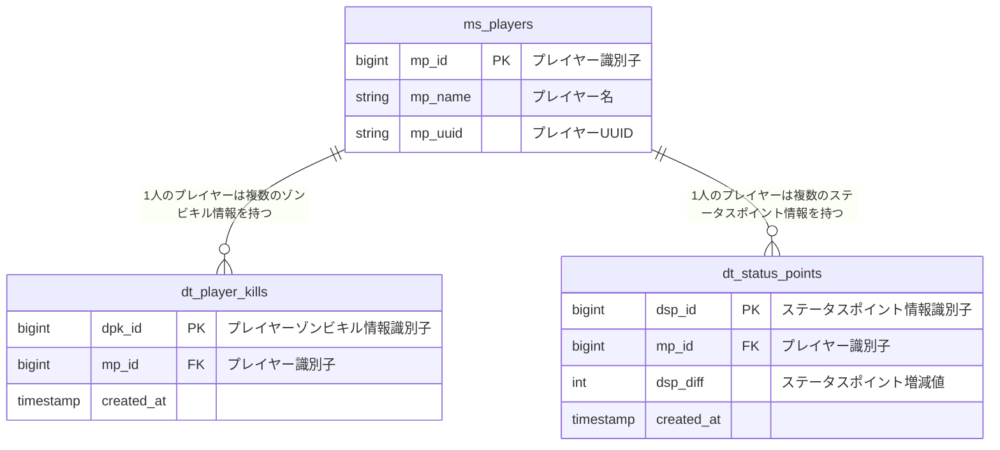

# データベース設計
本ドキュメントは「ZON-Kills」で用いるデータベース`zonkills`に関するドキュメントである。

## RDBMSについて
RDBMSはDocker Hubにある`mariadb:latest`を使用する。

## 各情報の取得方法
### プレイヤーゾンビキル数合計
以下のSQL文を実行することで取得可能
```
SELECT SUM(dpk_diff) diff, mp_name FROM dt_player_kills      
    INNER JOIN ms_players ON dt_player_kills.mp_id = ms_players.mp_id
    WHERE mp_name = プレイヤー名
```

### ステータスポイント合計
```
SELECT SUM(dsp_diff) diff, mp_name FROM dt_status_points 
    INNER JOIN ms_players ON dt_player_kills.mp_id = ms_players.mp_id
    WHERE mp_name = プレイヤー名
```

## テーブル一覧

| 名称             | 説明                                                                       | 
| ---------------- | -------------------------------------------------------------------------- | 
| ms_players       | プレイヤー管理テーブル。<br>プレイヤー情報が変更があった時はUPDATEとなる。 | 
| dt_player_kills  | プレイヤーがゾンビをキルした履歴を保存するテーブル。                       | 
| dt_status_points | プレイヤーがステータスポイントを獲得した履歴を保存するテーブル。           | 

## テーブル定義
### ms_players

| No  | 属性名  | 属性説明 | 長さ | 主キー | 必須 | 自動連番 | 外部キー | 
| --- | ------- | -------- | ---- | ------ | ---- | -------- | -------- | 
| 1   | mp_id   | int      | 11   | 〇     | 〇   | 〇       |          | 
| 2   | mp_name | varchar  | 36   |        | 〇   |          |          | 
| 3   | mp_uuid | varchar  | 36   |        | 〇   |          |          | 

### dt_player_kills

| No | 属性名        | 属性説明  | 長さ | 主キー | 必須 | 自動連番 | 外部キー | 
|----|------------| --------- | ---- | ----- | ---- | -------- | ------- | 
| 1  | dpk_id     | int       | 11   | 〇    | 〇   | 〇       |         | 
| 2  | mp_id      | int       | 11   | 〇    | 〇   |          | 〇      |
| 3  | created_at | timestamp | 8    |       | 〇   |          |         | 


### dt_status_points

| No  | 属性名     | 属性説明  | 長さ | 主キー | 必須 | 自動連番 | 外部キー | 
| --- | ---------- | --------- | ---- | ------ | ---- | -------- | -------- | 
| 1   | dsp_id     | int       | 11   | 〇     | 〇   | 〇       |          | 
| 2   | mp_id      | int       | 11   | 〇     | 〇   |          | 〇       | 
| 3   | dsp_diff   | int       | 11   |        | 〇   |          |          | 
| 4   | created_at | timestamp | 8    |        | 〇   |          |          | 

## ER図
