# データベース設計
本ドキュメントは「ZON-Kills」で用いるデータベース`zonkills`に関するドキュメントである。

## RDBMSについて
RDBMSはDocker Hubにある`mariadb:latest`を使用する。

## 各情報の取得方法
### プレイヤーゾンビキル数合計
以下のSQL文を実行することで取得可能
```
SELECT dpk_value FROM ms_players 
    INNER JOIN dt_player_kills ON ms_players.mp_id = dt_player_kills.mp_id 
    WHERE mp_name = プレイヤー名 
    ORDER BY created_at DESC LIMIT 1
```

### ステータスポイント合計
```
SELECT dsp_value FROM ms_players 
    INNER JOIN dt_status_points ON ms_players.mp_id = dt_status_points.mp_id 
    WHERE mp_name = プレイヤー名
    ORDER BY created_at DESC LIMIT 1
```

### 攻撃力
```
SELECT ds_strength FROM ms_players
    INNER JOIN dt_strength ON ms_players.mp_id = dt_strength.mp_id
    WHERE mp_name = プレイヤー名
    ORDER BY created_at DESC LIMIT 1
```

### HP
```
SELECT dh_hp FROM ms_players
    INNER JOIN dt_hp ON ms_players.mp_id = dt_hp.mp_id
    WHERE mp_name = プレイヤー名
    ORDER BY created_at DESC LIMIT 1
```

### HP再生速度
```
SELECT dh_hp FROM ms_players
    INNER JOIN dt_hp ON ms_players.mp_id = dt_hp.mp_id
    WHERE mp_name = プレイヤー名
    ORDER BY created_at DESC LIMIT 1
```


## テーブル一覧

| 名称               | 説明                                         | 
|------------------|--------------------------------------------| 
| ms_players       | プレイヤー管理テーブル。<br>プレイヤー情報が変更があった時はUPDATEとなる。 | 
| dt_player_kills  | プレイヤーがゾンビをキルした履歴を保存するテーブル。                 | 
| dt_status_points | プレイヤーがステータスポイントを獲得した履歴を保存するテーブル。           | 
| dt_strength      | プレイヤーの攻撃力情報を保存するテーブル                       | 
| dt_hp            | プレイヤーのHP情報を保存するテーブル                        | 
| dt_hp_regen      | プレイヤーのHP再生速度情報を保存するテーブル                    | 
| dt_mp            | プレイヤーのMP情報を保存するテーブル                        | 
| dt_mp_regen      | プレイヤーのMP再生速度情報を保存するテーブル                    | 
| dt_intelligence  | プレイヤーの器用さ情報を保存するテーブル                       | 

## テーブル定義
### ms_players

| No  | 属性名  | 属性説明 | 長さ | 主キー | 必須 | 自動連番 | 外部キー | 
| --- | ------- | -------- | ---- | ------ | ---- | -------- | -------- | 
| 1   | mp_id   | int      | 11   | 〇     | 〇   | 〇       |          | 
| 2   | mp_name | varchar  | 36   |        | 〇   |          |          | 
| 3   | mp_uuid | varchar  | 36   |        | 〇   |          |          | 

### dt_player_kills

| No | 属性名        | 属性説明  | 長さ | 主キー | 必須 | 自動連番 | 外部キー | 
|----|------------| --------- | ---- | ----- | ---- | -------- | ------- | 
| 1  | dpk_id     | int       | 11   | 〇    | 〇   | 〇       |         | 
| 2  | mp_id      | int       | 11   | 〇    | 〇   |          | 〇      |
| 3  | dpk_value  | int       | 11   |        | 〇   |          |          | 
| 4  | created_at | timestamp | 8    |       | 〇   |          |         | 


### dt_status_points

| No  | 属性名        | 属性説明  | 長さ | 主キー | 必須 | 自動連番 | 外部キー | 
| --- |------------| --------- | ---- | ------ | ---- | -------- | -------- | 
| 1   | dsp_id     | int       | 11   | 〇     | 〇   | 〇       |          | 
| 2   | mp_id      | int       | 11   | 〇     | 〇   |          | 〇       | 
| 3   | dsp_value  | int       | 11   |        | 〇   |          |          | 
| 4   | created_at | timestamp | 8    |        | 〇   |          |          | 

### dt_strength

| No  | 属性名         | 属性説明  | 長さ | 主キー | 必須 | 自動連番 | 外部キー | 
| --- |-------------| --------- | ---- | ------ | ---- | -------- | -------- | 
| 1   | ds_id       | int       | 11   | 〇     | 〇   | 〇       |          | 
| 2   | mp_id       | int       | 11   | 〇     | 〇   |          | 〇       | 
| 3   | ds_strength | int       | 11   |        | 〇   |          |          |
| 4   | created_at  | timestamp | 8    |        | 〇   |          |          | 

### dt_hp

| No  | 属性名      | 属性説明  | 長さ | 主キー | 必須 | 自動連番 | 外部キー | 
| --- |----------| --------- | ---- | ------ | ---- | -------- | -------- | 
| 1   | dh_id    | int       | 11   | 〇     | 〇   | 〇       |          | 
| 2   | mp_id    | int       | 11   | 〇     | 〇   |          | 〇       | 
| 3   | dh_hp    | int       | 11   |        | 〇   |          |          |
| 4   | created_at | timestamp | 8    |        | 〇   |          |          | 

### dt_hp_regen

| No  | 属性名          | 属性説明  | 長さ | 主キー | 必須 | 自動連番 | 外部キー | 
| --- |--------------| --------- | ---- | ------ | ---- | -------- | -------- | 
| 1   | dhr_id       | int       | 11   | 〇     | 〇   | 〇       |          | 
| 2   | mp_id        | int       | 11   | 〇     | 〇   |          | 〇       | 
| 3   | dhr_hp_regen | int       | 11   |        | 〇   |          |          |
| 4   | created_at   | timestamp | 8    |        | 〇   |          |          | 

### dt_mp

| No  | 属性名        | 属性説明  | 長さ | 主キー | 必須 | 自動連番 | 外部キー | 
| --- |------------| --------- | ---- | ------ | ---- | -------- | -------- | 
| 1   | dm_id      | int       | 11   | 〇     | 〇   | 〇       |          | 
| 2   | mp_id      | int       | 11   | 〇     | 〇   |          | 〇       | 
| 3   | dm_mp      | int       | 11   |        | 〇   |          |          |
| 4   | created_at | timestamp | 8    |        | 〇   |          |          | 

### dt_mp_regen

| No  | 属性名          | 属性説明  | 長さ | 主キー | 必須 | 自動連番 | 外部キー | 
| --- |--------------| --------- | ---- | ------ | ---- | -------- | -------- | 
| 1   | dmr_id       | int       | 11   | 〇     | 〇   | 〇       |          | 
| 2   | mp_id        | int       | 11   | 〇     | 〇   |          | 〇       | 
| 3   | dmr_mp_regen | int       | 11   |        | 〇   |          |          |
| 4   | created_at   | timestamp | 8    |        | 〇   |          |          | 

### dt_intelligence

| No  | 属性名             | 属性説明  | 長さ | 主キー | 必須 | 自動連番 | 外部キー | 
| --- |-----------------| --------- | ---- | ------ | ---- | -------- | -------- | 
| 1   | di_id           | int       | 11   | 〇     | 〇   | 〇       |          | 
| 2   | mp_id           | int       | 11   | 〇     | 〇   |          | 〇       | 
| 3   | di_intelligence | int       | 11   |        | 〇   |          |          |
| 4   | created_at      | timestamp | 8    |        | 〇   |          |          | 

## ER図

```mermaid
erDiagram
    ms_players {
        bigint mp_id PK "プレイヤー識別子"
        string mp_name "プレイヤー名"
        string mp_uuid "プレイヤーUUID"
    }
    dt_player_kills {
        bigint dpk_id PK "プレイヤーゾンビキル情報識別子"
        bigint mp_id FK "プレイヤー識別子"
        int dpk_value "ゾンビキル数合計"
        timestamp created_at
    }
    dt_status_points {
        bigint dsp_id PK "ステータスポイント情報識別子"
        bigint mp_id FK "プレイヤー識別子"
        int dsp_value "ステータスポイント"
        timestamp created_at
    }
    dt_strength {
        bigint ds_id PK "攻撃力情報識別子"
        bigint mp_id FK "プレイヤー識別子"
        int ds_strength "攻撃力"
        timestamp created_at
    }
    dt_hp {
        bigint dh_id PK "HP情報識別子"
        bigint mp_id FK "プレイヤー識別子"
        int dh_hp "HP"
        timestamp created_at
    }
    dt_hp_regen {
        bigint dhr_id PK "HP再生速度情報識別子"
        bigint mp_id FK "プレイヤー識別子"
        int dhr_hp_regen "HP再生速度"
        timestamp created_at
    }
    dt_mp {
        bigint dm_id PK "MP情報識別子"
        bigint mp_id FK "プレイヤー識別子"
        int dm_mp "MP"
        timestamp created_at
    }
    dt_mp_regen {
        bigint dmr_id PK "MP再生速度情報識別子"
        bigint mp_id FK "プレイヤー識別子"
        int dmr_id "MP再生速度"
        timestamp created_at
    }
    ms_players ||--o{ dt_player_kills : "1人のプレイヤーは複数のゾンビキル情報を持つ"
    ms_players ||--o{ dt_status_points : "1人のプレイヤーは複数のステータスポイント情報を持つ"
    ms_players ||--o{ dt_strength : "1人のプレイヤーは複数のス攻撃力情報を持つ"
    ms_players ||--o{ dt_hp : "1人のプレイヤーは複数のHP情報を持つ"
    ms_players ||--o{ dt_hp_regen : "1人のプレイヤーは複数のHP再生速度情報を持つ"
    ms_players ||--o{ dt_mp : "1人のプレイヤーは複数のMP情報を持つ"
    ms_players ||--o{ dt_mp_regen : "1人のプレイヤーは複数のMP再生速度情報を持つ"
```


## テーブル作成用SQL文
### ms_playersテーブル作成
```
CREATE TABLE ms_players (
    mp_id int(11) auto_increment primary key,
    mp_name varchar(36) not null,
    mp_uuid varchar(36) not null
);
```

### dt_player_killsテーブル作成
```
CREATE TABLE dt_player_kills (
	dpk_id int(11) auto_increment primary key,
	mp_id int(11) not null,
	dpk_value int(11) not null default 0,
	created_at timestamp default now(),
	foreign key fk_dpk_mp_id(mp_id) references ms_players(mp_id)
);
```

### dt_status_pointsテーブル作成
```
CREATE TABLE dt_status_points (
	dsp_id int(11) auto_increment primary key,
	mp_id int(11) not null,
	dsp_value int(11) not null default 0,
	created_at timestamp default now(),
	foreign key fk_dsp_mp_id(mp_id) references ms_players(mp_id)
);
```

### dt_strengthテーブル作成
```
CREATE TABLE dt_strength (
	ds_id int(11) auto_increment primary key,
	mp_id int(11) not null,
	ds_strength int(11) not null default 0,
	created_at timestamp default now(),
	foreign key fk_ds_mp_id(mp_id) references ms_players(mp_id)
);
```

### dt_hpテーブル作成
```
CREATE TABLE dt_hp (
	dh_id int(11) auto_increment primary key,
	mp_id int(11) not null,
	dh_hp int(11) not null default 0,
	created_at timestamp default now(),
	foreign key fk_dh_mp_id(mp_id) references ms_players(mp_id)
);
```

### dt_hp_regenテーブル作成
```
CREATE TABLE dt_hp_regen (
	dhr_id int(11) auto_increment primary key,
	mp_id int(11) not null,
	dhr_hp_regen int(11) not null default 0,
	created_at timestamp default now(),
	foreign key fk_dhr_mp_id(mp_id) references ms_players(mp_id)
);
```

### dt_mpテーブル作成
```
CREATE TABLE dt_mp (
	dm_id int(11) auto_increment primary key,
	mp_id int(11) not null,
	dm_mp int(11) not null default 0,
	created_at timestamp default now(),
	foreign key fk_dm_mp_id(mp_id) references ms_players(mp_id)
);
```

### dt_mp_regenテーブル作成
```
CREATE TABLE dt_mp_regen (
	dmr_id int(11) auto_increment primary key,
	mp_id int(11) not null,
	dmr_mp_regen int(11) not null default 0,
	created_at timestamp default now(),
	foreign key fk_dmr_mp_id(mp_id) references ms_players(mp_id)
);
```